Statistical Simulation in R: Monte Carlo, CLT & Bootstrap
================
Minerva Bermúdez Ferrer

- [Overview](#overview)
- [1. Monte Carlo simulation](#1-monte-carlo-simulation)
  - [1.1 Estimating a probability and
    pi](#11-estimating-a-probability-and-pi)
  - [1.2 Approximating integrals](#12-approximating-integrals)
  - [1.3 Compound Poisson–lognormal
    losses](#13-compound-poissonlognormal-losses)
- [2. Random variables and the central limit
  theorem](#2-random-variables-and-the-central-limit-theorem)
  - [2.1 Weibull simulation by inverse
    transform](#21-weibull-simulation-by-inverse-transform)
  - [2.2 Sampling means: normal
    population](#22-sampling-means-normal-population)
  - [2.3 CLT across three parent
    distributions](#23-clt-across-three-parent-distributions)
  - [2.4 Mean versus median with
    contamination](#24-mean-versus-median-with-contamination)
- [3. Nonparametric bootstrap](#3-nonparametric-bootstrap)
  - [3.1 Bootstrap of the ozone
    median](#31-bootstrap-of-the-ozone-median)
  - [3.2 Bootstrap of the ozone 99th
    percentile](#32-bootstrap-of-the-ozone-99th-percentile)
  - [3.3 Classical and bootstrap intervals for the
    mean](#33-classical-and-bootstrap-intervals-for-the-mean)
- [Conclusions and limitations](#conclusions-and-limitations)
- [Provenance](#provenance)

# Overview

This project brings together three topics from my own statistics
laboratory work: Monte Carlo estimation, sampling distributions and the
central limit theorem (CLT), and nonparametric bootstrap. Each section
includes an experiment, its statistical motivation and an
interpretation. The simulations use fixed random seeds for
reproducibility. All computations below use **base R**; no external data
file or separately defined functions are required.

# 1. Monte Carlo simulation

## 1.1 Estimating a probability and pi

For a point uniformly distributed on the square $[-1,1]^2$, the
probability of falling inside the unit disk is $P(X^2+Y^2\leq 1)=\pi/4$.
The sample proportion estimates this probability; multiplying it by four
estimates $\pi$. For independent indicators, the estimated standard
error of the proportion is `sd(event)/sqrt(nsim)`.

``` r
nsim <- 10000
set.seed(1)
x <- runif(nsim, -1, 1)
y <- runif(nsim, -1, 1)
event <- (x^2 + y^2 <= 1)

probability_estimate <- mean(event)
probability_se <- sd(event) / sqrt(nsim)
cat("Estimated probability:", probability_estimate, "\n")
```

    ## Estimated probability: 0.7806

``` r
cat("Monte Carlo standard error:", probability_se, "\n")
```

    ## Monte Carlo standard error: 0.004138608

``` r
cat("Estimate of pi:", 4 * probability_estimate, "\n")
```

    ## Estimate of pi: 3.1224

``` r
cat("Exact probability:", pi / 4, "\n")
```

    ## Exact probability: 0.7853982

``` r
estim <- cumsum(event) / seq_len(nsim)
# Estimated Bernoulli standard error at each simulation count (n >= 2).
n <- 2:nsim
estim.err <- sqrt(estim[n] * (1 - estim[n]) / (n - 1))
z <- qnorm(0.975)
plot(seq_len(nsim), estim, type = "l", ylim = c(0, 1),
     xlab = "Number of simulations", ylab = "Estimated probability",
     main = "Monte Carlo convergence: unit disk")
lines(n, estim[n] - z * estim.err, col = "blue", lty = 3)
lines(n, estim[n] + z * estim.err, col = "blue", lty = 3)
abline(h = pi / 4, col = "red", lty = 2)
```

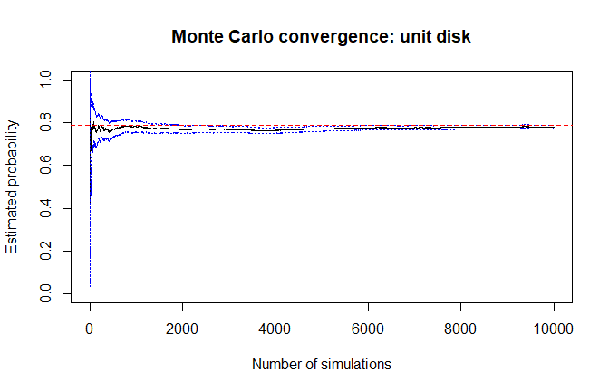<!-- -->

The dotted bands use a normal approximation and are not reliable for the
very first draws. Simulation error decreases *on average* as the number
of draws increases; a particular estimate need not approach the true
value monotonically.

## 1.2 Approximating integrals

If $U$ is uniform on $[a,b]$, then $\int_a^b g(x)\,dx=(b-a)\,E[g(U)]$.
We estimate two integrals from my original Monte Carlo exercise and
compare them against `integrate()` as a numerical benchmark. The Monte
Carlo standard error must include the interval width $(b-a)$.

``` r
f1 <- function(x) dbeta(x, 2.5, 5)
nsim <- 10000
set.seed(1)
x <- runif(nsim, 0.2, 0.4)
fx1 <- f1(x)
width <- 0.4 - 0.2
approx1 <- width * mean(fx1)
se1 <- width * sd(fx1) / sqrt(nsim)
reference1 <- integrate(f1, 0.2, 0.4)$value
print(c(Monte_Carlo = approx1, MC_standard_error = se1,
        Numerical_reference = reference1))
```

    ##         Monte_Carlo   MC_standard_error Numerical_reference 
    ##        0.4438716194        0.0002303014        0.4441655568

``` r
estim <- width * cumsum(fx1) / seq_len(nsim)
plot(seq_len(nsim), estim, type = "l", xlab = "Number of simulations",
     ylab = "Estimated integral", main = "Integral of a beta density")
abline(h = reference1, col = "red", lty = 2)
```

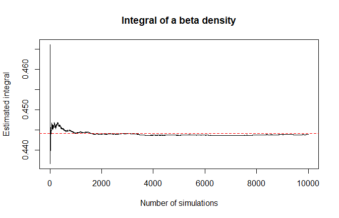<!-- -->

The second integral is over $[0,1]$ with integrand
$g(x)=\sin(x)e^{-x} f_{\mathrm{Beta}(2.5,5)}(x)$.

``` r
f2 <- function(x) sin(x) * exp(-x) * dbeta(x, 2.5, 5)
set.seed(1)
x <- runif(nsim, 0, 1)
fx2 <- f2(x)
approx2 <- mean(fx2)
se2 <- sd(fx2) / sqrt(nsim)
reference2 <- integrate(f2, 0, 1)$value
print(c(Monte_Carlo = approx2, MC_standard_error = se2,
        Numerical_reference = reference2))
```

    ##         Monte_Carlo   MC_standard_error Numerical_reference 
    ##         0.216933814         0.001937706         0.217225535

``` r
estim <- cumsum(fx2) / seq_len(nsim)
plot(seq_len(nsim), estim, type = "l", xlab = "Number of simulations",
     ylab = "Estimated integral", main = "Weighted beta-density integral")
abline(h = reference2, col = "red", lty = 2)
```

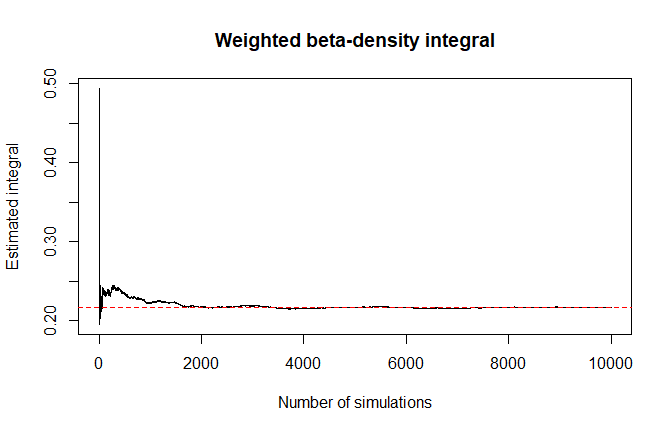<!-- -->

The reported Monte Carlo uncertainty is the simulation standard error,
not the error of the deterministic integration routine.

## 1.3 Compound Poisson–lognormal losses

In the original exercise, the number of payments follows a Poisson
distribution, $N\sim\mathrm{Poisson}(17)$; individual payments follow a
lognormal distribution with log-scale parameters $\mu=3.5$ and
$\sigma=1.1$. We simulate total loss $S_N=\sum_{i=1}^{N}X_i$ and compare
its simulated 99.5th percentile with a normal approximation having the
same mean and variance.

``` r
mu <- 3.5
sig <- 1.1
lam <- 17
EX <- exp(mu + sig^2 / 2)
VX <- EX^2 * (exp(sig^2) - 1)
ES <- lam * EX
VS <- lam * VX + lam * EX^2

nsim <- 5000
S <- double(nsim)
set.seed(1)
for (i in seq_len(nsim)) {
  n <- rpois(1, lam)
  if (n > 0) S[i] <- sum(rlnorm(n, mu, sig))
}

hist(S, breaks = 30, probability = TRUE,
     main = "Compound Poisson--lognormal losses", xlab = "Total loss")
lines(density(S), col = "blue")
```

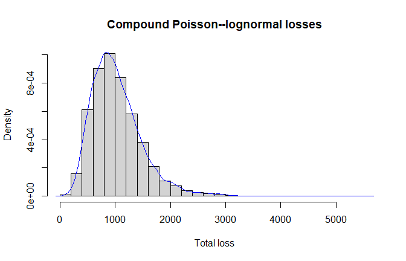<!-- -->

``` r
print(c(Theoretical_mean = ES, Simulated_mean = mean(S),
        Theoretical_sd = sqrt(VS), Simulated_sd = sd(S)))
```

    ## Theoretical_mean   Simulated_mean   Theoretical_sd     Simulated_sd 
    ##        1030.9267        1028.8193         457.8798         453.9001

``` r
print(c(Simulated_VaR_99_5 = unname(quantile(S, 0.995)),
        Normal_approximation = qnorm(0.995, mean = ES, sd = sqrt(VS))))
```

    ##   Simulated_VaR_99_5 Normal_approximation 
    ##             2752.155             2210.347

The simulated tail quantile describes the specified compound model; the
normal quantile is only an approximation and can differ for a skewed
loss distribution. The quantile estimate itself has Monte Carlo
uncertainty.

# 2. Random variables and the central limit theorem

## 2.1 Weibull simulation by inverse transform

For the Weibull CDF $F(x)=1-e^{-(\lambda x)^\alpha}$, inverse-transform
sampling gives $X=(-\log U)^{1/\alpha}/\lambda$ for $U\sim U(0,1)$. The
original exercise uses $\lambda=0.5$, $\alpha=2$. **In R,
`shape = alpha` and `scale = 1/lambda`.**

``` r
n <- 1000
set.seed(1)
u <- runif(n)
lambda <- 0.5
alpha <- 2
x <- (-log(u))^(1 / alpha) / lambda
hist(x, freq = FALSE, breaks = "FD",
     main = "Weibull: inverse-transform sampling", xlab = "Value")
lines(density(x), col = "blue")
curve(dweibull(x, shape = alpha, scale = 1 / lambda),
      add = TRUE, col = "red")
```

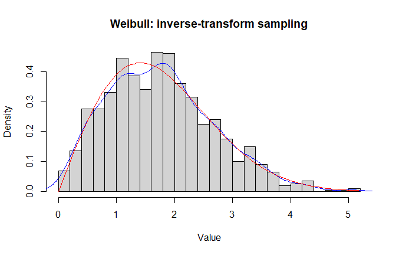<!-- -->

``` r
print(ks.test(x, pweibull, shape = alpha, scale = 1 / lambda))
```

    ## 
    ##  Asymptotic one-sample Kolmogorov-Smirnov test
    ## 
    ## data:  x
    ## D = 0.024366, p-value = 0.5928
    ## alternative hypothesis: two-sided

The histogram and theoretical density provide a visual check. A
non-significant goodness-of-fit test does not *prove* that observations
follow a particular distribution.

## 2.2 Sampling means: normal population

If observations are independent $N(10,1^2)$, the sample mean of $n=10$
observations follows $N(10,1^2/10)$ exactly. The code below follows the
sample-by-row simulation from my lab (with fewer repetitions to keep the
report quick to reproduce).

``` r
mu <- 10
sigma <- 1
n <- 10
nsim <- 10000
set.seed(1)
mysamples <- matrix(rnorm(nsim * n, mean = mu, sd = sigma),
                    ncol = n, nrow = nsim)
v.means <- rowMeans(mysamples)
hist(v.means, breaks = 30, freq = FALSE,
     main = "Sampling distribution of the mean", xlab = "Sample mean")
lines(density(v.means), col = "blue")
curve(dnorm(x, mean = mu, sd = sigma / sqrt(n)),
      col = "red", add = TRUE)
```

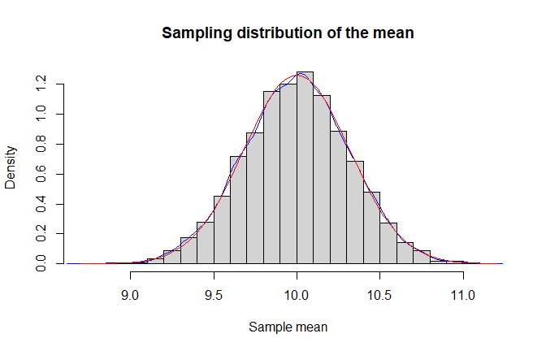<!-- -->

``` r
print(c(Simulated_mean = mean(v.means), Theoretical_mean = mu,
        Simulated_sd = sd(v.means), Theoretical_sd = sigma / sqrt(n)))
```

    ##   Simulated_mean Theoretical_mean     Simulated_sd   Theoretical_sd 
    ##        9.9977559       10.0000000        0.3163804        0.3162278

## 2.3 CLT across three parent distributions

We compare sample means from uniform $U(-5,5)$, exponential with rate
$0.1$, and lognormal with meanlog $0$, sdlog $1$, using $n=10,30,100$.
Each row in the simulated matrix is one sample, as in the original lab.
The red curve is the normal approximation using the **correct
theoretical mean and standard deviation of the sample mean** for each
population.

``` r
a <- -5
b <- 5
nsim <- 1000
set.seed(1)
par(mfrow = c(1, 3))
for (n in c(10, 30, 100)) {
  mysamples <- matrix(runif(nsim * n, a, b), ncol = n, nrow = nsim)
  v.means <- rowMeans(mysamples)
  hist(v.means, breaks = 20, freq = FALSE,
       main = paste("Uniform, n =", n), xlab = "Sample mean")
  curve(dnorm(x, mean = 0, sd = sqrt((b - a)^2 / (12 * n))),
        col = "red", add = TRUE)
}
```

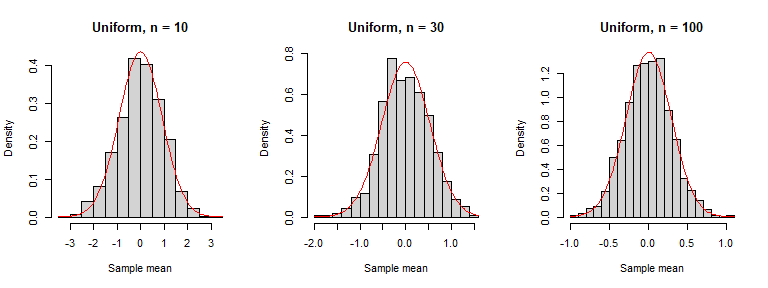<!-- -->

``` r
par(mfrow = c(1, 1))
```

``` r
lambda <- 0.1
set.seed(1)
par(mfrow = c(1, 3))
for (n in c(10, 30, 100)) {
  mysamples <- matrix(rexp(nsim * n, rate = lambda),
                      ncol = n, nrow = nsim)
  v.means <- rowMeans(mysamples)
  hist(v.means, breaks = 20, freq = FALSE,
       main = paste("Exponential, n =", n), xlab = "Sample mean")
  curve(dnorm(x, mean = 1 / lambda, sd = (1 / lambda) / sqrt(n)),
        col = "red", add = TRUE)
}
```

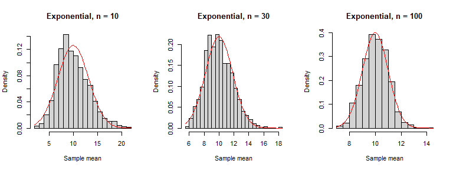<!-- -->

``` r
par(mfrow = c(1, 1))
```

``` r
mu <- 0
sigma <- 1
set.seed(1)
par(mfrow = c(1, 3))
for (n in c(10, 30, 100)) {
  mysamples <- matrix(rlnorm(nsim * n, meanlog = mu, sdlog = sigma),
                      ncol = n, nrow = nsim)
  v.means <- rowMeans(mysamples)
  hist(v.means, breaks = 20, freq = FALSE,
       main = paste("Lognormal, n =", n), xlab = "Sample mean")
  pop_mean <- exp(mu + sigma^2 / 2)
  pop_var <- exp(2 * mu + sigma^2) * (exp(sigma^2) - 1)
  curve(dnorm(x, mean = pop_mean, sd = sqrt(pop_var / n)),
        col = "red", add = TRUE)
}
```

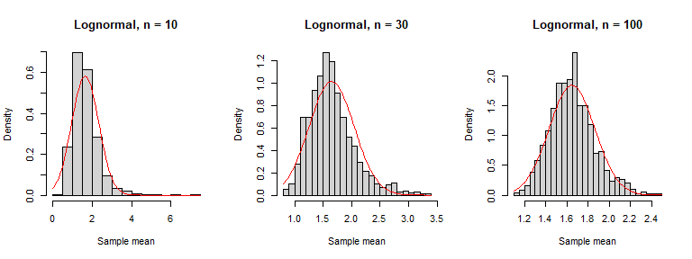<!-- -->

``` r
par(mfrow = c(1, 1))
```

The CLT applies to standardized *sample means*, not to the original
observations. Convergence need not be equally fast: the lognormal
population is right-skewed, so a normal approximation at modest sample
sizes can still be imperfect. Larger `nsim` makes the simulation
smoother; larger `n` changes the sampling distribution itself.

## 2.4 Mean versus median with contamination

My original lab compares estimators under a 95% $N(0,1)$ and 5%
$N(3,3^2)$ mixture. The MSE is calculated **relative to the location
zero of the uncontaminated component**, not relative to the mean of the
mixture (which equals 0.15). This target matters for interpretation.

``` r
n <- 100
nsim <- 1000
set.seed(1)
j <- rbinom(n * nsim, 1, 0.05)
mysamples <- matrix(rnorm(n * nsim, 3 * j, 1 + 2 * j),
                    nrow = nsim, ncol = n)
mymeans <- apply(mysamples, 1, mean)
mymedians <- apply(mysamples, 1, median)
boxplot(mymedians, mymeans, names = c("Medians", "Means"),
        main = "Estimation under contamination", ylab = "Estimate")
abline(h = 0, lty = 2, col = "red")
```

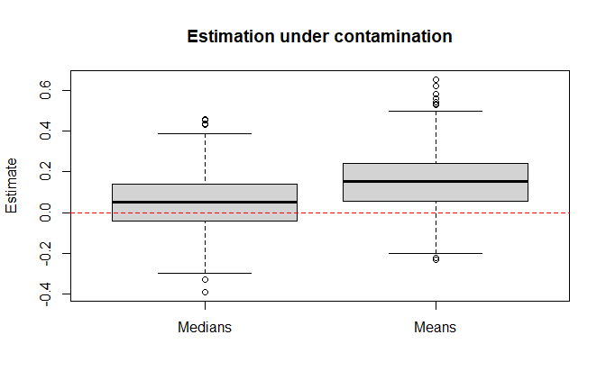<!-- -->

``` r
print(c(MSE_mean_vs_zero = mean(mymeans^2),
        MSE_median_vs_zero = mean(mymedians^2)))
```

    ##   MSE_mean_vs_zero MSE_median_vs_zero 
    ##         0.04236130         0.01990137

The comparison is conditional on this mixture and estimand; it is not a
universal claim that the median is always the preferable estimator.

# 3. Nonparametric bootstrap

R’s built-in `airquality` dataset supplies the ozone and wind
observations. We remove missing values separately for each variable.
This basic resampling scheme treats observations as independent, an
assumption that may be questionable for consecutive daily measurements.

## 3.1 Bootstrap of the ozone median

Following my original lab, generate `B=1000` resamples with replacement,
compute the median of each sample, then estimate the bias, standard
error and a 90% **percentile** confidence interval.

``` r
x <- airquality$Ozone
x <- x[!is.na(x)]
n <- length(x)
Tx <- median(x)
B <- 1000
set.seed(1)
xboot <- matrix(sample(x, size = n * B, replace = TRUE), nrow = B)
Tx.boot <- apply(xboot, 1, median)
bootstrap_se <- sd(Tx.boot)
bootstrap_bias <- mean(Tx.boot) - Tx
percentile_ci <- quantile(Tx.boot, probs = c(0.05, 0.95))
print(c(Sample_median = Tx, Bootstrap_bias = bootstrap_bias,
        Bootstrap_SE = bootstrap_se))
```

    ##  Sample_median Bootstrap_bias   Bootstrap_SE 
    ##      31.500000      -0.418000       3.597808

``` r
print(percentile_ci)
```

    ##   5%  95% 
    ## 24.0 36.5

``` r
hist(Tx.boot, main = "Bootstrap distribution: ozone median", freq = FALSE,
     xlab = "Bootstrap median")
lines(density(Tx.boot), col = "blue")
abline(v = Tx, col = "red", lty = 3)
```

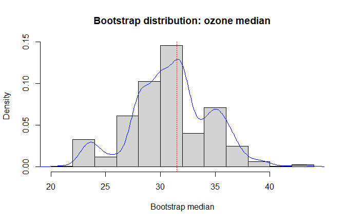<!-- -->

## 3.2 Bootstrap of the ozone 99th percentile

The same resampling procedure estimates the uncertainty of an extreme
sample quantile. With relatively few observations, the 99th percentile
can be particularly sensitive to the largest recorded values; the
percentile interval should therefore be interpreted cautiously.

``` r
Tx <- unname(quantile(x, probs = 0.99))
set.seed(1)
xboot <- matrix(sample(x, size = n * B, replace = TRUE), nrow = B)
Tx.boot <- apply(xboot, 1, quantile, probs = 0.99)
print(c(Sample_quantile_99 = Tx,
        Bootstrap_bias = mean(Tx.boot) - Tx,
        Bootstrap_SE = sd(Tx.boot)))
```

    ## Sample_quantile_99     Bootstrap_bias       Bootstrap_SE 
    ##          133.05000            1.74580           18.73443

``` r
print(quantile(Tx.boot, probs = c(0.05, 0.95)))
```

    ##     5%    95% 
    ## 114.25 168.00

``` r
hist(Tx.boot, main = "Bootstrap distribution: ozone 99th percentile",
     freq = FALSE, xlab = "Bootstrap 99th percentile")
lines(density(Tx.boot), col = "blue")
abline(v = Tx, col = "red", lty = 3)
```

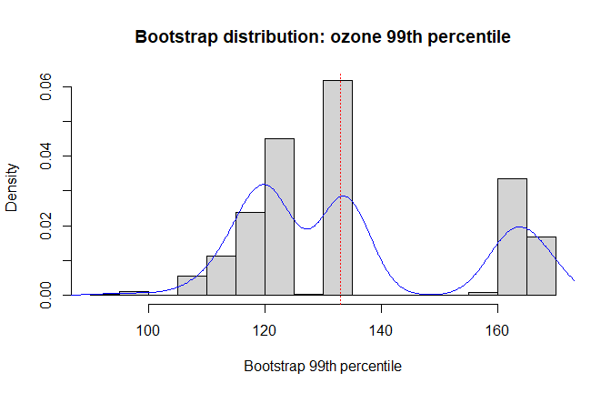<!-- -->

## 3.3 Classical and bootstrap intervals for the mean

Finally, compare a 99% Student-t interval with a 99% bootstrap
percentile interval for ozone and wind. A bootstrap is not automatically
more accurate simply because it does not assume that the *raw data* are
normal; both methods have assumptions, including about dependence.

``` r
x <- airquality$Ozone
x <- x[!is.na(x)]
n <- length(x)
B <- 1000
classical_ci <- t.test(x, conf.level = 0.99)$conf.int
set.seed(1)
xboot <- matrix(sample(x, size = n * B, replace = TRUE), nrow = B)
mean_boot <- rowMeans(xboot)
bootstrap_ci <- quantile(mean_boot, probs = c(0.005, 0.995))
print(rbind(Student_t_99 = classical_ci,
            Bootstrap_percentile_99 = unname(bootstrap_ci)))
```

    ##                             [,1]     [,2]
    ## Student_t_99            34.10692 50.15170
    ## Bootstrap_percentile_99 35.06030 49.96797

``` r
x <- airquality$Wind
x <- x[!is.na(x)]
n <- length(x)
classical_ci <- t.test(x, conf.level = 0.99)$conf.int
set.seed(1)
xboot <- matrix(sample(x, size = n * B, replace = TRUE), nrow = B)
mean_boot <- rowMeans(xboot)
bootstrap_ci <- quantile(mean_boot, probs = c(0.005, 0.995))
print(rbind(Student_t_99 = classical_ci,
            Bootstrap_percentile_99 = unname(bootstrap_ci)))
```

    ##                             [,1]     [,2]
    ## Student_t_99            9.214552 10.70048
    ## Bootstrap_percentile_99 9.230663 10.65753

Compare the **computed** endpoints rather than inferring normality from
similar-looking intervals. A percentile bootstrap from independent
resampling does not correct for temporal dependence in `airquality`.

# Conclusions and limitations

- Monte Carlo estimation links an expectation to a probability, an
  integral, or a simulated risk measure; report its simulation error
  where applicable.
- The CLT describes the behavior of sample means. Approximation quality
  depends on the underlying distribution and sample size.
- Bootstrap resampling estimates a statistic’s sampling variability
  under a specified resampling scheme. Extreme quantiles and serial
  dependence require additional care.
- The experiments are educational demonstrations, not a validated model
  for clinical, environmental or financial decision-making.

# Provenance

Adapted from my **own 2025 R laboratory submissions** on Monte Carlo
(Lab 8), random-variable simulation and the CLT (Lab 9), and bootstrap
(Lab 10). The original numerical experiments are retained and organized
into a single report. Editorial changes include clearer explanations,
corrected Monte Carlo uncertainty calculations, a smaller
normal-simulation sample count for easier reproduction, and base-R
bootstrap instead of optional add-on packages. The project uses R’s
built-in `airquality` data.
